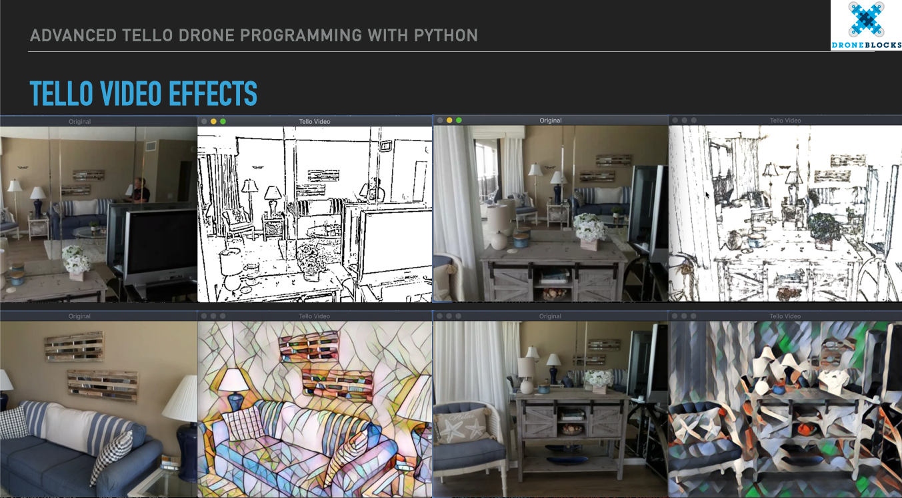

# Advanced Tello Programming in Python

### *When Art meets Technology*

This repository contains the project code for the DroneBlocks Advanced Tello Programming course - 'When Art meets Technology'

## Computer Art

The *Art meets Technology* DroneBlocks course shows you how you can use the Tello video feed, with OpenCV image processing to change how the Tello sees the world.

Below is a small example of some of the video effects that the course will cover.



## Install Instructions

* Download the course content zip file from this [Github Repo](https://github.com/dbaldwin/tello-adv-arts)

* Unzip the file.  This will create a folder

* Rename the folder to remove the '-master' portion.  The directory should be called: `tello-adv-arts`

* Open a terminal window and change directory to the folder with the course content

* Create a python virtual environment:

Check to make sure you are using Python 3.6 or greater:

```shell
python --version
```

or
```shell
python3 --version
```

Make sure to use the python or python3 command that returns the version number of 3.6 or greater.

*MacOS* or *Windows*

```shell
python3 -m venv venv
```

* Activate python virtual environment

*MacOS*
```shell
source venv/bin/activate
```

*Windows*
```shell
venv\Scripts\activate.bat 
```

* Install course requirments

```shell
pip install -r requirements.txt
```

```shell
pip install https://github.com/damiafuentes/DJITelloPy/archive/master.zip
```


## Examples

Below are some examples of scripts to run to see image effects in action.

These examples use the computers web cam to simulate the Tello drone video feed.  This is a great way to get an idea of you can expect when you run it with the Tello drone.

### Style Transfer Example

This example shows how we can take the style from one image and apply it to the content of a video feed.

`python tello_script_runner.py --display-video --tello-video-sim --handler style_transfer_user_script.py`


### Image Effects Example

This example shows how we can implement image processing and apply it to the content of a video feed.

`python tello_script_runner.py --display-video --tello-video-sim --handler image_effects_user_script.py`

## Tests

Change directory into the `tests` directory.

`python <test file name>`


## Tello Commands

`python tello_script_runner.py --display-video --handler style_transfer_user_script.py`


## Breaking Changes

### tello_script_runner 

Please use the tello_script_runner.py file from this repo instead of using the script from a previous course.  This version of the tello_script_runner.py now expects a return value from the *handler* method of either 'None' or a copy of an image.

* Look to see if handler is returning a new image and if so, will use the returned image to display.  This means the handler function is expected to return an image OR return None

* 